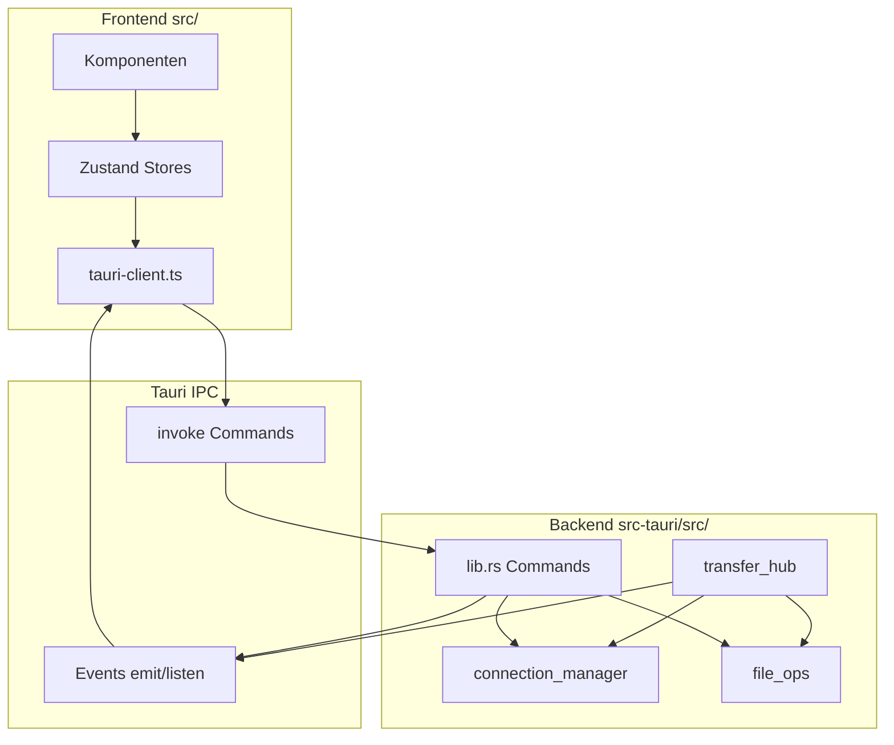
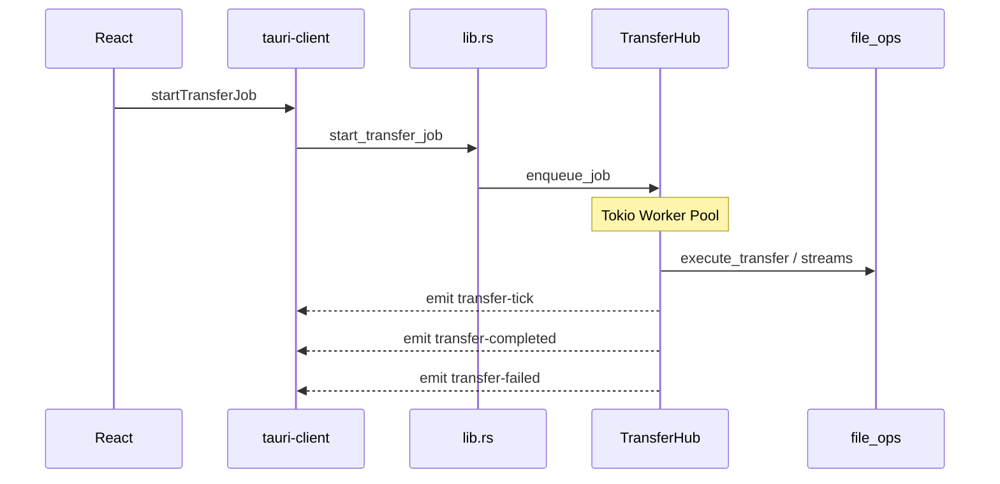

# Architekturübersicht

FZ-Next ist eine Desktop-App: **React 19 + TypeScript + Vite** im Webview, **Tauri 2 + Rust** als Host und für alle Netzwerk-/Dateioperationen. Die UI spricht **nur** über Tauri-IPC mit dem Backend; es gibt keine direkten Sockets im Frontend.

## Schichten

## Transfer-Pipeline (vereinfacht)

Nach erfolgreichem Abschluss eines Tasks wird u. a. `transfer-completed` emittiert; Fortschritt wird über gedrosselte `transfer-tick`-Events aktualisiert. Details: [`../technical-debt.md`](../technical-debt.md) und [`transfer_hub.rs`](../../src-tauri/src/transfer_hub.rs).

## Backend-Lebenszyklus

In [`lib.rs`](../../src-tauri/src/lib.rs) registriert `setup` eine **`TransferHub`-Instanz** (`tauri::State`) mit Worker-Anzahl aus den Benutzereinstellungen (`transfer_concurrency`, begrenzt). Verbindungen und Sessions leben im **`connection_manager`** (globale/pooling-Logik), nicht im Frontend.

## IPC: `invoke`-Befehle

Rust-Funktionsnamen (Snake_case) werden vom Frontend über [`tauri-client.ts`](../../src/services/tauri-client.ts) aufgerufen. Tauri mappt Payload-Felder typischerweise in `camelCase`.

| Befehl (Rust) | Kurzbeschreibung |
|---------------|------------------|
| `list_connections` | Gespeicherte Servereinträge |
| `connect_server` / `update_connection` | Verbindung aufbauen / Eintrag aktualisieren |
| `test_connection` | Verbindung testen |
| `list_remote_files` | Remote-Verzeichnis listen |
| `rename_remote_file` / `chmod_remote_file` / `remove_remote_path` / `remove_remote_paths` | Remote-Operationen |
| `create_remote_directory` / `create_remote_file` | Remote anlegen |
| `rename_local_path` / `remove_local_path` / `remove_local_paths` / `chmod_local_path` | Lokale Operationen |
| `create_local_directory` / `create_local_file` | Lokal anlegen |
| `list_local_files` | Lokales Verzeichnis listen |
| `prepare_drag_export_file` | Temporärer Export für Drag aus Remote (Backend; kein Wrapper in `tauri-client.ts`) |
| `ping_connection` | Session anstoßen |
| `vault_store` / `vault_get_password` | Keyring schreiben / lesen |
| `trust_host_fingerprint` | Vertrauensentscheid TLS/SSH |
| `master_password_*` | Status, Setup, Unlock, Change, Reset, Enable-Flag |
| `start_upload` / `start_download` / `start_bridge_transfer` / `resume_bridge_transfer` | Einzel-/Bridge-Transfers (Legacy-Pfad neben Job-API) |
| `start_transfer_job` | Hauptpfad: Job aus Auswahl + Zielpfad |
| `move_paths` | Verschieben (lokal oder remote) |
| `check_collisions` | Ziel-Kollisionen vor Transfer |
| `list_transfers` / `cancel_transfer` / `pause_transfer` / `resume_transfer` / `reprioritize_transfer` / `retry_transfer` | Queue-Steuerung |
| `pause_all_transfers` / `resume_all_transfers` / `cancel_all_transfers` | Global |
| `open_in_editor` / `prepare_remote_edit` / `confirm_remote_edit_upload` / `set_remote_edit_session_prompt_mode` / `start_remote_edit_watch` | Remote bearbeiten |
| `get_file_modified` | mtime für Watcher |
| `get_settings` / `update_settings` / `reset_settings` / `get_home_dir` | Einstellungen |

## IPC: Events (Backend → Frontend)

| Event | Emitter | Nutzung im Frontend |
|-------|---------|---------------------|
| `transfer-tick` | `transfer_hub.rs` | Fortschritt, u. a. [`use-transfer-hub.ts`](../../src/hooks/use-transfer-hub.ts) |
| `transfer-completed` | `transfer_hub.rs` | Abschluss eines Tasks |
| `transfer-failed` | `transfer_hub.rs` | Task-Fehler mit Strukturpayload |
| `transfer-log` | `transfer_hub.rs` | Logzeilen |
| `transfer-event` | `transfer_hub.rs` | Generische Transfer-Ereignisse |
| `transfer-error` | `lib.rs` (`start_transfer_job` Dispatch-Fehler) | Toast + Log |
| `remote-edit-changed` | `lib.rs` (Dateiwatcher-Thread) | Remote-Edit-UI |
| `remote-edit-uploaded` | `lib.rs` (nach Auto-Upload) | **Derzeit ohne Listener** in `src/` (Payload nutzt `MenuEventPayload`) |
| `menu-action` | `lib.rs` (Menüleiste) | [`App.tsx`](../../src/App.tsx) |

## Verwandte Dokumente

- [module-map.md](module-map.md) – Dateizuordnung
- [../security/error-handling.md](../security/error-handling.md) – Fehlerpfade
- [../features/status.md](../features/status.md) – was die UI wirklich abdeckt
